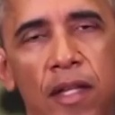
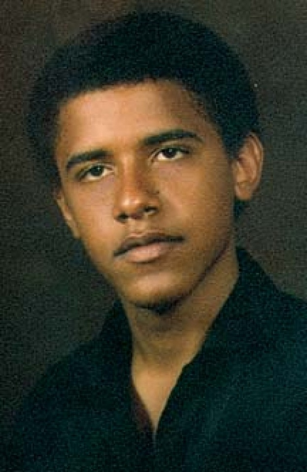
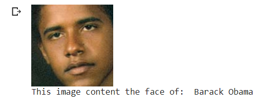

# MLCourse
This is the Assignment for CO3117 Machine Learning Course from HCMUT.

### Frontal Face Extraction
The person representation used in this paper are extracted by a 2D pose estimator and a human parser:
The frontal face used in this code are extracted by dlib library:
* [dlib C++ library](https://github.com/davisking/dlib)

### Dataset
The dataset is 3 videos of Barack Obama, Harry Potter and Andrew Ng which can be download from Youtube. For this project, I trimmed the video to target-face only video for easy frontal face extraction. The video is put together in this repo, however, can get directly the image set I used from ```face.zip```. <br>
   

### Running code
Follow the order in ```Face_identity_recognition.ipynb```.

### Result
Being simple, the model given the result of highly correct with the dataset, however, configures might involve in the near future to help the model perform better without some sort of overfitting.
 <br>

<!---
### Todo list
- [x] Code of testing the first stage.
- [x] Data preparation code.
- [x] Code of training the first stage.
- [x] Shape context matching and warping.
- [x] Code of testing the second stage.
- [x] Code of training the second stage.
-->
